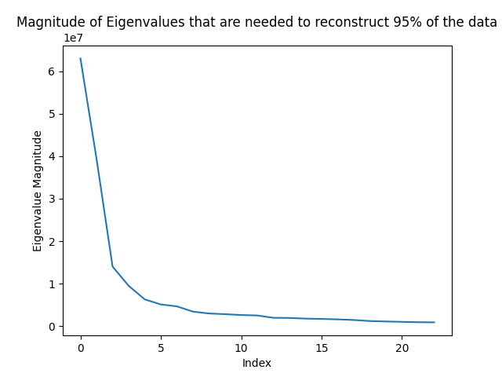
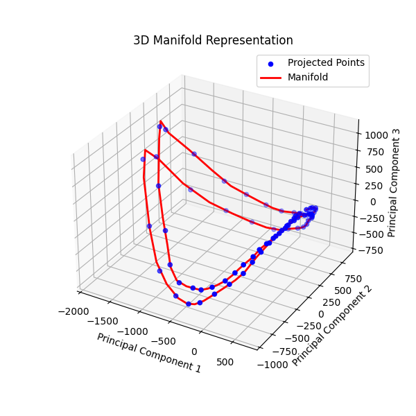

Implementation of the concepts shared in the lecture series ["First Principles of Computer Vision"](https://www.youtube.com/@firstprinciplesofcomputerv3258) by prof. Shree Nayar:
1. [Learning Appearance](https://www.youtube.com/watch?v=oPAKEWAhkg8)
2. [Principal Component Analysis](https://www.youtube.com/watch?v=M6fBAzcw1Ps)
3. [Finding Principal Components](https://www.youtube.com/watch?v=DcngAJXMoRo)
4. [PCA and SVD](https://www.youtube.com/watch?v=ILu4-Lk-gZQ)
5. [Parametric Appearance Representation](https://www.youtube.com/watch?v=58MDlj5xS1s)
6. [Appearance Matching](https://www.youtube.com/watch?v=0WNiYrRjJbM)

Download the coil dataset: [link](https://www.kaggle.com/datasets/jessicali9530/coil100/data)

Output images for Coil Dataset: \
Number of Eigen vectors vs Magnitude of Eigenvlaues needed to reconstuct 95% of the data: \
 

Manifold Representation of 3 Principal Components: \

